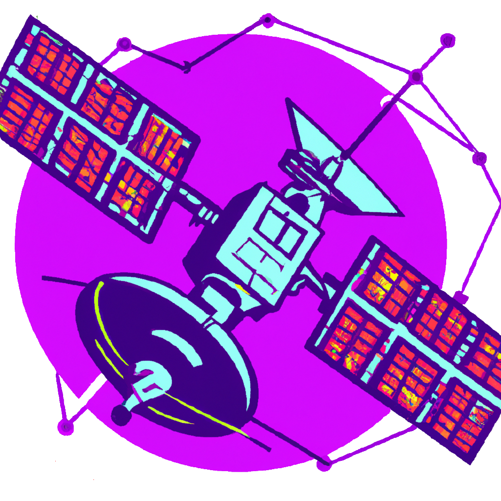

<h1 align="center" style="font-size: 48px;">Mir IoT Hub</h1>
<h3 align="center">Mir hub is the ultimate IoT hub solution for tommorow's interconnected world
</h3>
<h3 align="center">Develop easier. Connect faster. Scale quicker.
</h3>

 

  
  

# What is Mir Iot Hub?

Enable highly secure and reliable communication between your Internet of Things (IoT) application and the devices it manages. Mur IoT Hub provides a cloud-hosted solution back end to connect virtually any device. Extend your solution from the cloud to the edge with per-device authentication, built-in device management, device observability, device data, and scaled provisioning.

Mir IoT Hub, which acts as your command center: processes messages, triggers actions, and collects information about your system. Then, it sends this information further to the appropriate system or application.

# Content

- [Features](#features)
- [Documentation](#documentation)
- [Installation](#installation)
- [Getting started](#getting-started)
  - [Device side apps](#device-side-apps)
  - [Server side apps](#server-side-apps)
- [Modules](#modules)
  - [User defined module](#user-defined-module)
  - [Configuration module](#configuration-module)
  - [Observability module](#observability-module)
  - [User templated-data module](#user-templated-data-module)
- [Road map](#roadmap)
- [License](#license)

# Features

# Documentation

# Installation

# Getting started

## Device side apps

## Server side apps

# Modules

## User defined module

## Configuration module

## Observability module

## User templated-data module

# Roadmap

- [x] Create oxi, the device side sdk
  - [x] rust-sdk
  - [ ] python-sdk
- [ ] Create dizer, the server side sdk
  - [ ] rust-sdk
  - [ ] python-sdk
- [ ] Create cockpit, the web ui
- [x] Create redox, the configuration module
- [ ] Create flux, the obersavility module
- [ ] Create propeller, the user templated-data module
- [ ] Create swarm, the device simulator sdk

# License

Source code for MirHub is licensed under a MIT license.