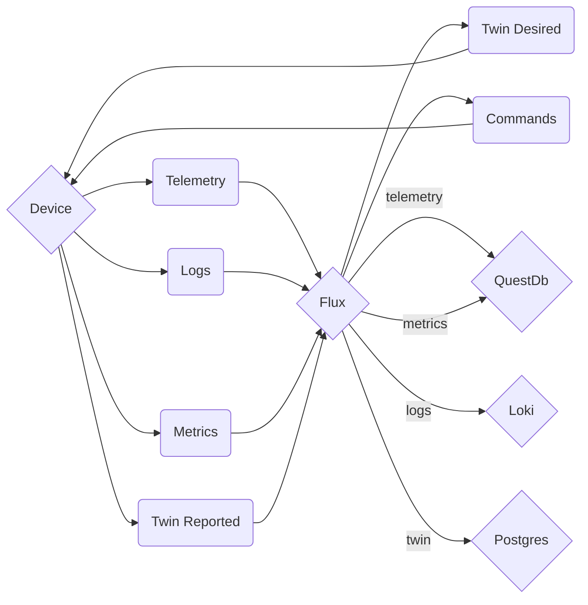

# Architecture Design Record
## ADR-09, Routing Twin

AMQP will be used to route message twin.


### Metadata
A single topic queue will be used for device metadata. Metadata are reported by the framework while reported properties by the user of the framework.

```json
"deviceId": "devA", // device id
"etag": "AAAAAAAAAAc=", // model id
"status": "enabled", // enabled, disabled
"statusReason": "provisioned", // provisioned, registered, blocked, unblocked
"statusUpdateTime": "0001-01-01T00:00:00", // timestamp UTC
"connectionState": "connected", // connected, disconnected
"lastActivityTime": "2015-02-30T16:24:48.789Z", // timestamp UTC
"cloudToDeviceMessageCount": 0, // count
"version": 2, // might get useful for versioning
```

To Flux, lot of messages, Own exchange, iot-flux
<device_type>.twin_meta.<version_type>
<device_type>.twin_desired.<version_type>
<device_type>.telemetry.<version_type>
<device_type>.metrics<version_type>
<device_type>.logs<version_type>

To Device, lot of queues, Own exchange, iot-device
<device_id>.twin_reported.<version_type>
<device_id>.commands<version_type>

### Reported Properties

```json
"reported": {
    "telemetryConfig": {
        "sendFrequency": "5m",
        "status": "success"
    },
    "batteryLevel": 55,
    "$metadata" : {...}, // timestamp of each field with last update
    "$version": 4
}
```

### Desired Properties

```json
"desired": {
    "telemetryConfig": {
        "sendFrequency": "5m",
        "status": "success"
    },
    "batteryLevel": 55,
    "$metadata" : {...}, // timestamp of each field with last update
    "$version": 4
}
```



