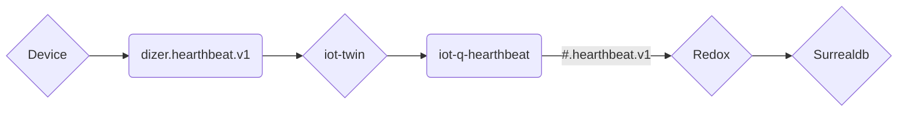
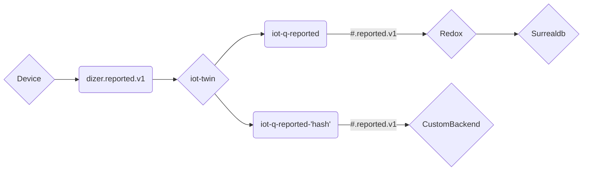
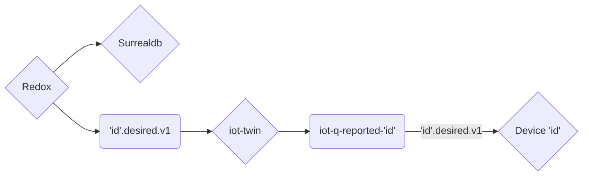
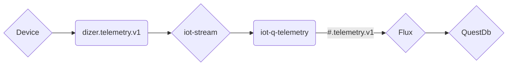
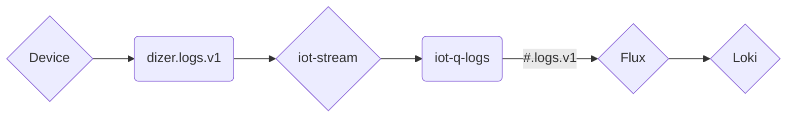
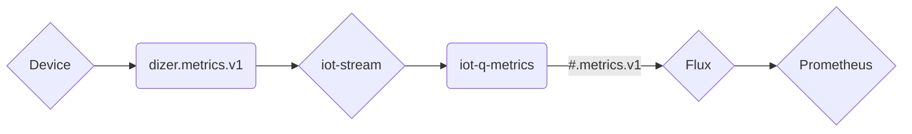

### Twin Heartbeat

```mermaid
graph LR;
    A{Device}-->B(dizer.hearthbeat.v1)
    B-->C{iot-twin}
    C-->D(iot-q-hearthbeat)
    D-->|#.hearthbeat.v1|E{Redox}
    E-->F{Surrealdb}
```

### Twin Reported

```mermaid
graph LR;
    A{Device}-->B(dizer.reported.v1)
    B-->C{iot-twin}
    C-->D(iot-q-reported)
    D-->|#.reported.v1|E{Redox}
    E-->F{Surrealdb}
    C-->G(iot-q-reported-'hash')
    G-->|#.reported.v1|H{CustomBackend}
```

### Twin Desired

```mermaid
graph LR;
    A{Redox}-->F{Surrealdb}
    A{Redox}-->B('id'.desired.v1)
    B-->C{iot-twin}
    C-->D(iot-q-reported-'id')
    D-->|'id'.desired.v1|E{Device 'id'}
```

### Telemetry

```mermaid
graph LR;
    A{Device}-->B(dizer.telemetry.v1)
    B-->C{iot-stream}
    C-->D(iot-q-telemetry)
    D-->|#.telemetry.v1|E{Flux}
    E-->F{QuestDb}
```

### Logs

```mermaid
graph LR;
    A{Device}-->B(dizer.logs.v1)
    B-->C{iot-stream}
    C-->D(iot-q-logs)
    D-->|#.logs.v1|E{Flux}
    E-->F{Loki}
```

### Metrics

```mermaid
graph LR;
    A{Device}-->B(dizer.metrics.v1)
    B-->C{iot-stream}
    C-->D(iot-q-metrics)
    D-->|#.metrics.v1|E{Flux}
    E-->F{Prometheus}
```
